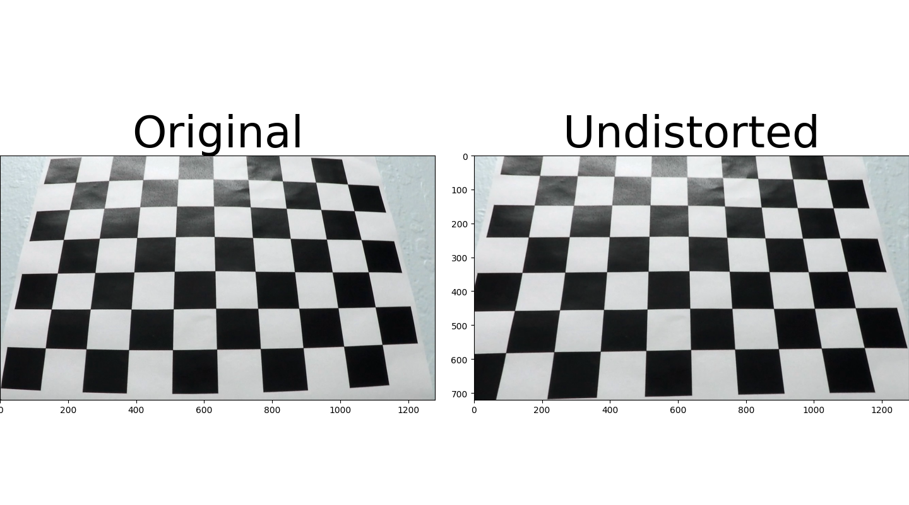
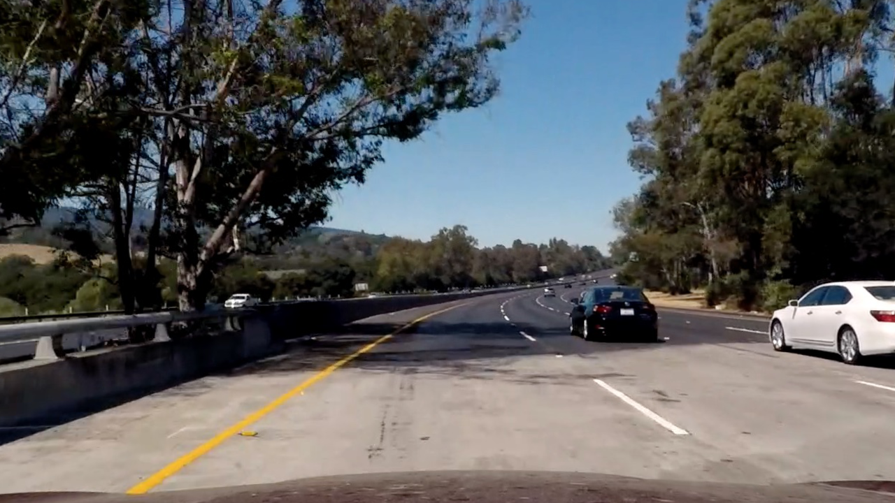
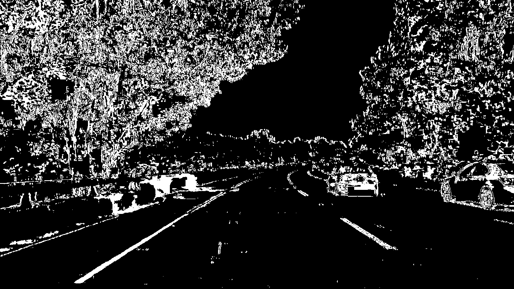
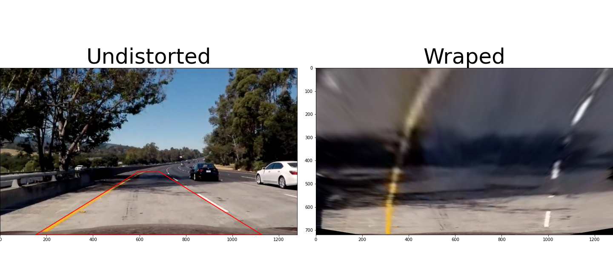
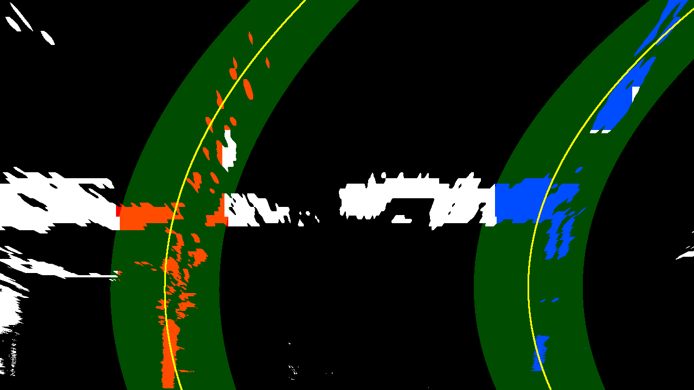
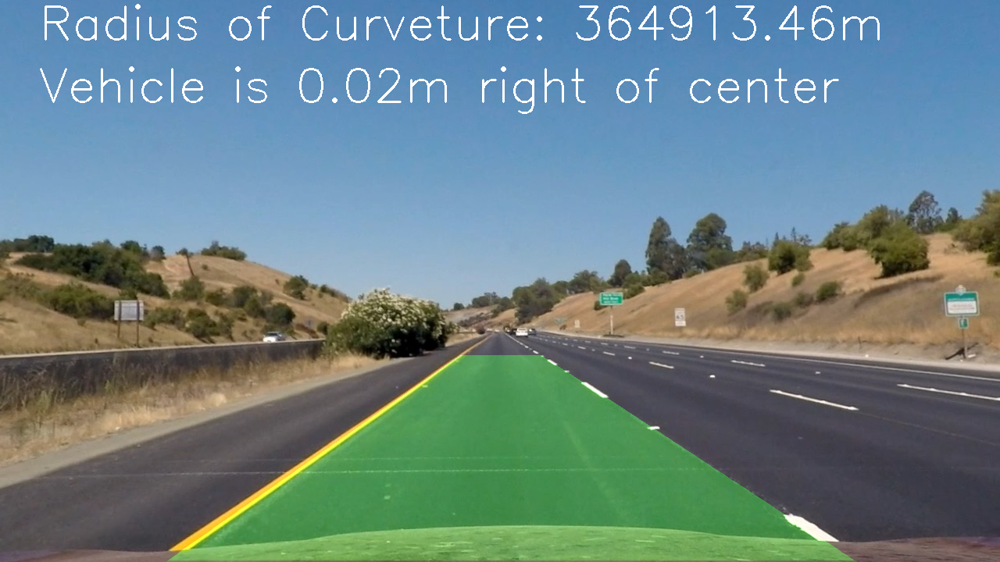

## Writeup 

---

**Advanced Lane Finding Project**

The goals / steps of this project are the following:

* Compute the camera calibration matrix and distortion coefficients given a set of chessboard images.
* Apply a distortion correction to raw images.
* Use color transforms, gradients, etc., to create a thresholded binary image.
* Apply a perspective transform to rectify binary image ("birds-eye view").
* Detect lane pixels and fit to find the lane boundary.
* Determine the curvature of the lane and vehicle position with respect to center.
* Warp the detected lane boundaries back onto the original image.
* Output visual display of the lane boundaries and numerical estimation of lane curvature and vehicle position.

[//]: # (Image References)

[image1]: ./examples/undistort_output.png "Undistorted"
[image2]: ./test_images/test1.jpg "Road Transformed"
[image3]: ./examples/binary_combo_example.jpg "Binary Example"
[image4]: ./examples/warped_straight_lines.jpg "Warp Example"
[image5]: ./examples/color_fit_lines.jpg "Fit Visual"
[image6]: ./examples/example_output.jpg "Output"
[video1]: ./project_video.mp4 "Video"

## [Rubric](https://review.udacity.com/#!/rubrics/571/view) Points

### Here I will consider the rubric points individually and describe how I addressed each point in my implementation.  

---

### Writeup / README

#### 1. Provide a Writeup / README that includes all the rubric points and how you addressed each one.  You can submit your writeup as markdown or pdf.  [Here](https://github.com/udacity/CarND-Advanced-Lane-Lines/blob/master/writeup_template.md) is a template writeup for this project you can use as a guide and a starting point.  

You're reading it!

### Camera Calibration

#### 1. Briefly state how you computed the camera matrix and distortion coefficients. Provide an example of a distortion corrected calibration image.

The code for this step is contained in the first code cell of the IPython notebook located in "./find_line.ipynb".

The function used to calculate the camera matrix named `calibrate_camera()`. It's similar to the function in the lessons excise. I used `cv2.calibrateCamera()` to calculate the camera matrix and the five distortion parameters. Additionally I add the ability to return a new matrix and the an roi in case of large distortion. The opencv function `cv2.undistort()` is used to get the undistorted image:



### Pipeline (single images)

#### 1. Provide an example of a distortion-corrected image.

To demonstrate this step, I will describe how I apply the distortion correction to one of the test images like this one:


    
#### 2. Describe how (and identify where in your code) you used color transforms, gradients or other methods to create a thresholded binary image.  Provide an example of a binary image result.

I used a combination of color (in HLS space) and gradient thresholds to generate a binary image.  It's defined as the function `filter_im(img)` in the class `Lane_finder`. The thresholds are `s_thresh=(128, 255), sx_thresh=(31, 180)`. Here's an example of my output for this step.  



#### 3. Describe how (and identify where in your code) you performed a perspective transform and provide an example of a transformed image.

The function for perspective transformation is defined as `def get_perspective_transform()` in class `Find_line`:
    
```python
self.points_x = np.array([0.1609375 , 0.4671875 , 0.53671875, 0.86953125])
self.points_y = np.array([1, 0.63194444, 0.63194444, 1])
def get_perspective_transform(self, size, offset=(300, 0)):
        offset_x, offset_y = offset
        w, h = size
        src_vertices = np.vstack((self.points_x*w, self.points_y*h)).transpose().astype(np.float32)
        dst_vertices = np.array([[offset_x, h], [offset_x, offset_y], [w-offset_x, offset_y], [w-offset_x, h]], dtype=np.float32)
        return cv2.getPerspectiveTransform(src_vertices, dst_vertices)
```
The code results in the following source and destination. 

| Source        | Destination   | 
|:-------------:|:-------------:| 
| 206, 720      | 300, 720      |
| 598, 455      | 300, 0        | 
| 687, 455      | 920, 0        |
| 1113, 720     | 920, 720      |

I verified that my perspective transform was working as expected by drawing the `src` and `dst` points onto a test image and its warped counterpart to verify that the lines appear parallel in the warped image.



#### 4. Describe how (and identify where in your code) you identified lane-line pixels and fit their positions with a polynomial?

Initially, the line pixels are searched with the sliding window method as defined in function `find_pixels_window()` in class `Lane_finder`. With these found pixels, two polinomial lines with second order are fit. After that, the pipeline seraches pixels around these two lines within the given margin as defined as `search_around_poly()`. 


#### 5. Describe how (and identify where in your code) you calculated the radius of curvature of the lane and the position of the vehicle with respect to center.

I did this inside the Python class `Line`, which represents each lane line with useful properties. There is a property named `curverad_world`, which calculates the radius of curvature from image space into real world space. 

#### 6. Provide an example image of your result plotted back down onto the road such that the lane area is identified clearly.

I implemented this step in function `process()` in `Lane_finder`, which can also generate top view plotting.



---

### Pipeline (video)

#### 1. Provide a link to your final video output.  Your pipeline should perform reasonably well on the entire project video (wobbly lines are ok but no catastrophic failures that would cause the car to drive off the road!).

Here's a [link to my video result](./project_video_out.mp4)

---

### Discussion

#### 1. Briefly discuss any problems / issues you faced in your implementation of this project.  Where will your pipeline likely fail?  What could you do to make it more robust?

Here I'll talk about the approach I took, what techniques I used, what worked and why, where the pipeline might fail and how I might improve it if I were going to pursue this project further.  
* I used a line buffer, which keeps a number of last found lane-lines, it did smooth the detected lane

And there's some weakness of my pipeline. And I also want to ask some questions here. 
1. It took me much time to tune the parameters of thresholding with color spaces or gradient based. So is there some easy way or some optimal combination of these parameters to get a better filtered binary image?
2. The hard coded **perspective transform** is not always able to get a perpect top view, are we able to generate the perspective matrix **dynamically**/**adaptivly**?
3. My pipeline was not able to deal with the challege videos. Do we have to use **deep learning** approach to do that?
4. And My pipeline is slow, it only reaches 14 fps for the test videos. Any suggetions for optimizing the **efficiency**?

Thank you very much for the reviewing and for the questions. 